# Assignment 1 – VPC & Networking

## Overview

The objective was to build a segmented network environment including:

- A custom VPC
- One public subnet
- One private subnet
- Internet access configuration
- Route table configuration
- EC2 deployment across both subnets
- Secure access using Security Groups
- Bastion host implementation (Bonus)
- Enable CloudWatch monitoring on instances


## Architecture Diagram


## 1. VPC Configuration

A custom VPC was created using the CIDR block:

- **10.0.0.0/16**

Within this VPC:

- One **public subnet**
- One **private subnet**

This segmentation allows separation between publicly accessible resources and internal infrastructure.

### VPC Details

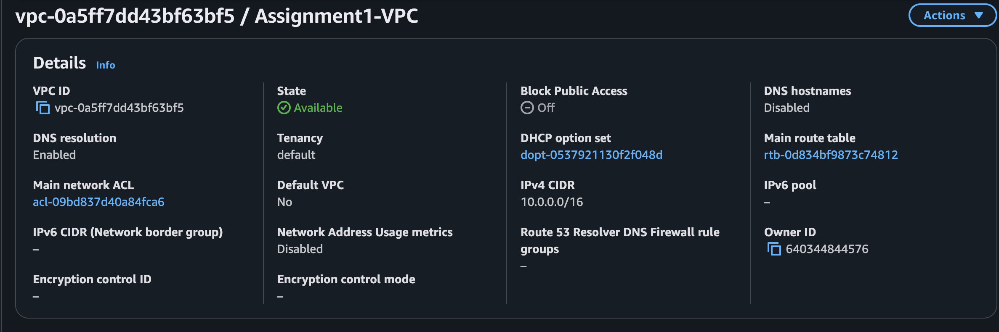

### Public Subnet

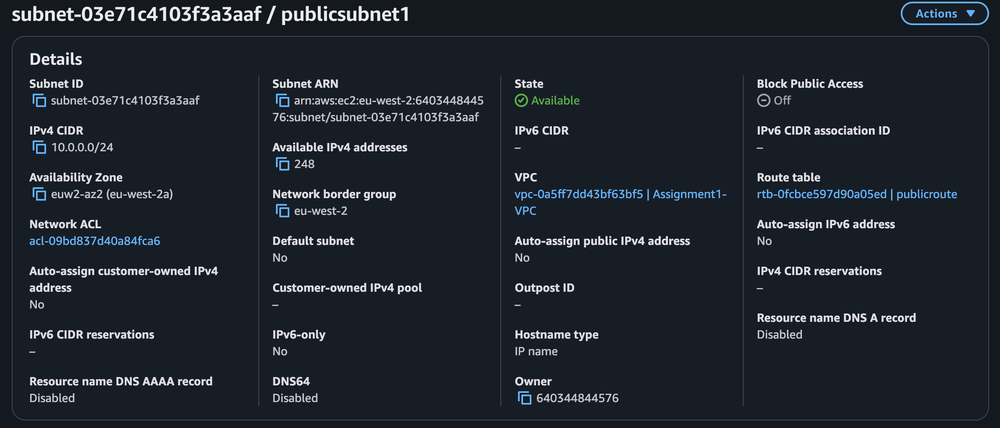

### Private Subnet

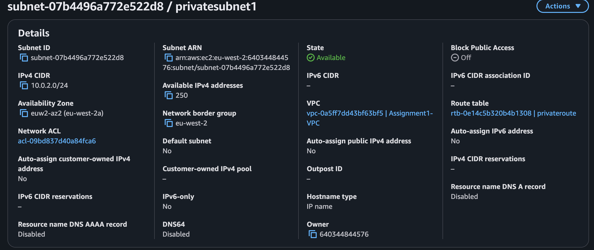


## 2. Internet Access Configuration

To enable controlled internet access:

- An **Internet Gateway (IGW)** was created and attached to the VPC.
- An **Elastic IP** was allocated.
- A **NAT Gateway** was deployed in the public subnet using the Elastic IP.

This setup allows:

- Public subnet → direct internet access via IGW  
- Private subnet → outbound internet access via NAT Gateway  

### Internet Gateway

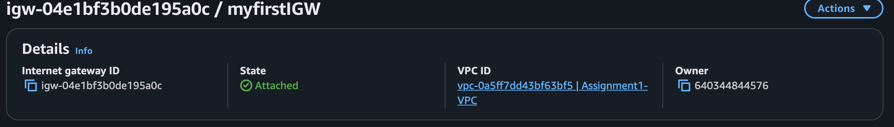

### Elastic IP

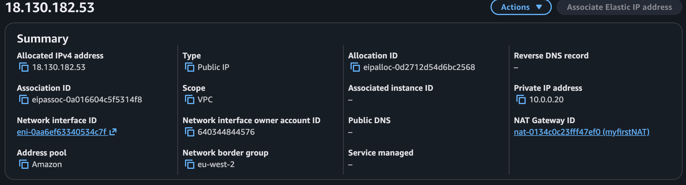

### NAT Gateway

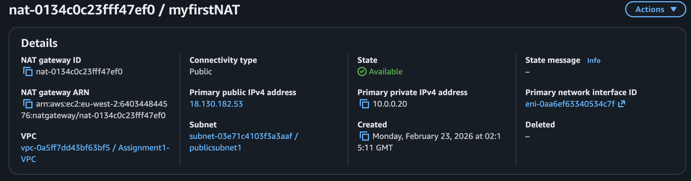

## 3. Route Tables

Routing was configured to correctly manage internet traffic for both subnets.

### Public Route Table


This allows resources in the public subnet to communicate directly with the internet.

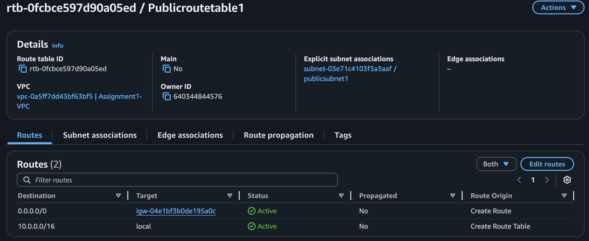


### Private Route Table

This allows private subnet instances to access the internet **outbound only**, while remaining inaccessible from the public internet.

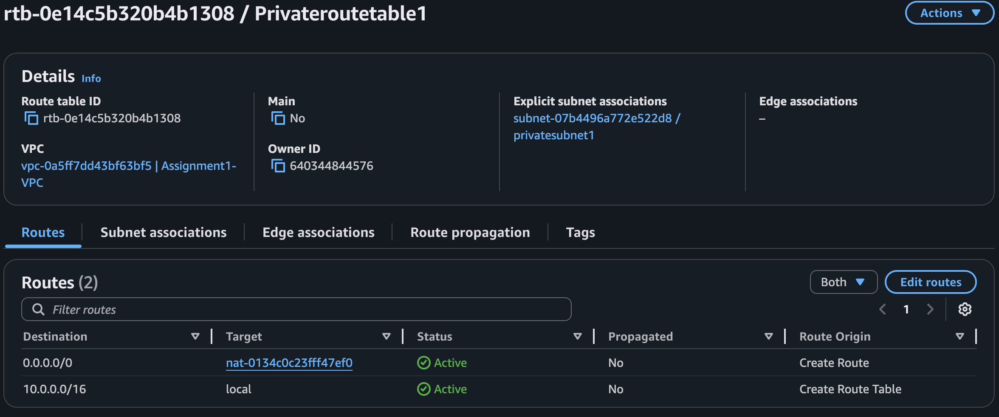


## 4. EC2 Deployment

Two EC2 instances were launched across the subnets:

### Public EC2

- Deployed in the public subnet
- Assigned a public IPv4 address

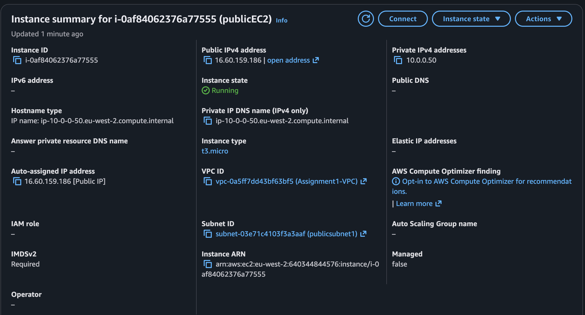

## Public EC2 – Nginx Page

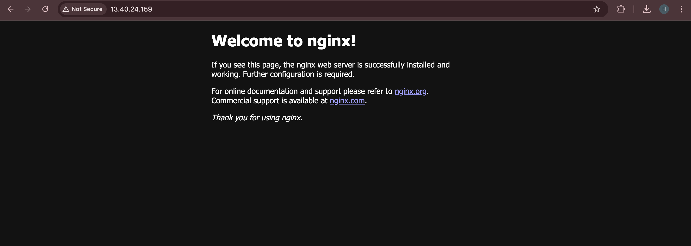

The EC2 instance page loaded after I installed Nginx.

Commands used:

```bash
sudo yum update -y
sudo yum install nginx -y
sudo systemctl start nginx
sudo systemctl enable nginx
```
### Private EC2

- Deployed in the private subnet
- No public IPv4 address
- Accessible only internally via Bastion host

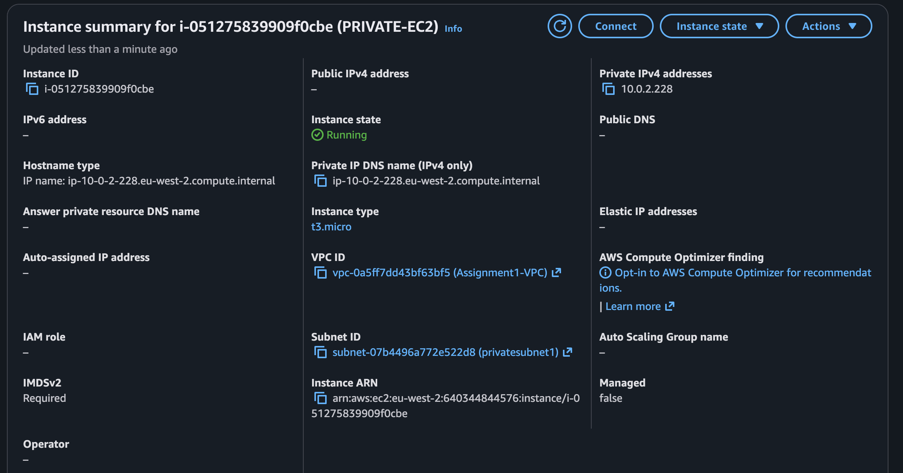

## 5. Security Configuration

Security Groups were configured to enforce controlled access between resources.

### Public EC2 Security Group

- SSH (22) → Allowed from my public IP only
- HTTP (80) → Allowed from my public IP only

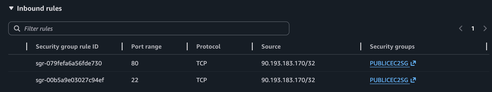


### Private EC2 Security Group

SSH (22) → Allowed only from Bastion Security Group


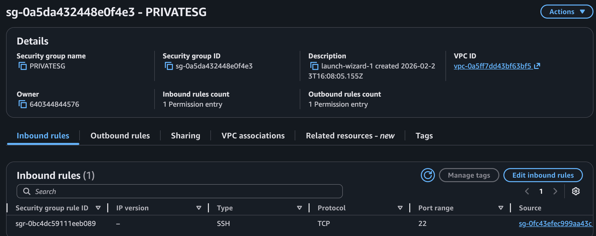


## Bastion Host (Bonus)

A Bastion host was deployed in the public subnet to securely access the private EC2 instance.

The Bastion Security Group allows SSH only from my IP address.

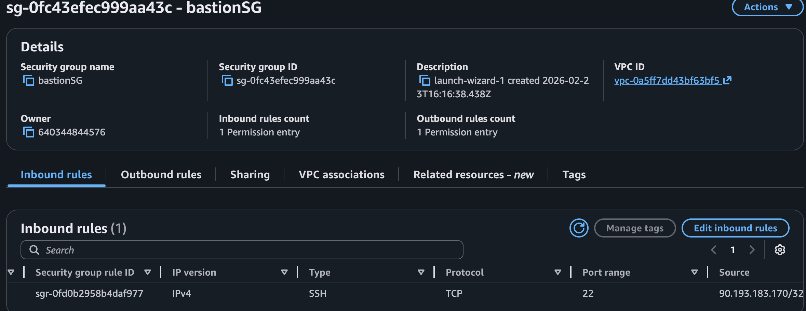

I SSH into my bastion host from my local machine.
Then from the bastion, I SSH into my private EC2 using its private IP.

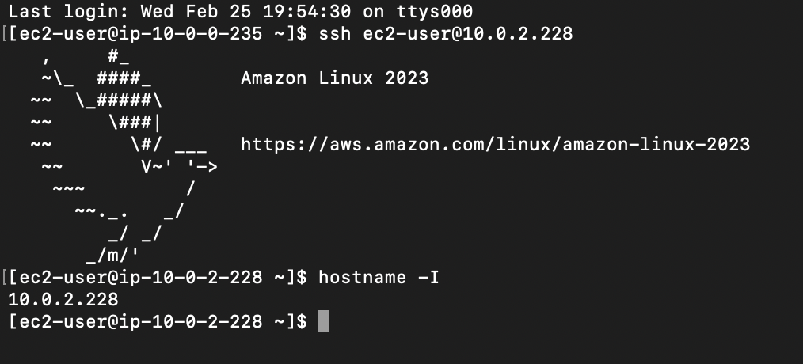


## CloudWatch Monitoring (Bonus)

Basic CloudWatch monitoring was enabled for EC2 instances to track:

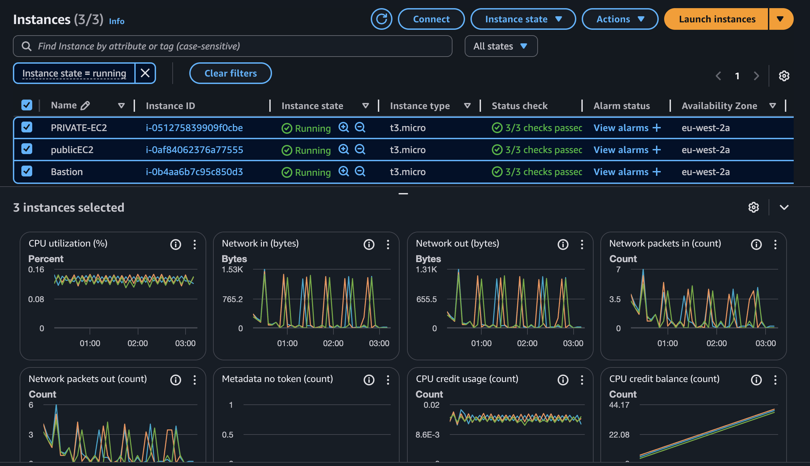


**Learnings:**
* The critical difference between public and private subnets for security.
* How route tables explicitly control the flow of traffic to an Internet Gateway or NAT Gateway.
* The practical function of a Bastion Host for providing secure, controlled access to private resources.

 **Challenges:**
* **Challenge:** My private EC2 instance couldn't connect to the internet for updates.
* **Solution:** Realized the private route table was missing a `0.0.0.0/0` route pointing to the NAT Gateway.
* **Challenge:** I couldn't SSH into the private instance from the Bastion Host.
* **Solution:** Corrected the private instance's security group to allow inbound SSH traffic specifically from the Bastion Host's security group.
