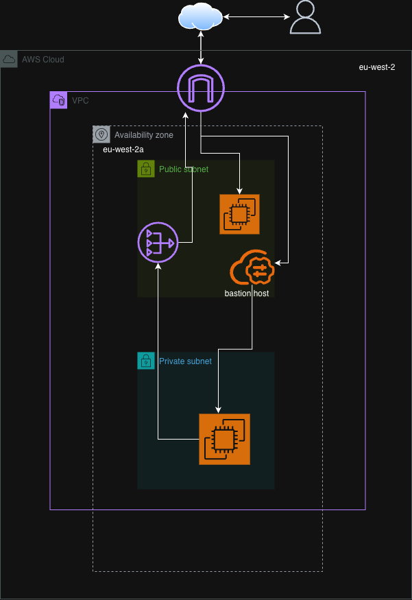
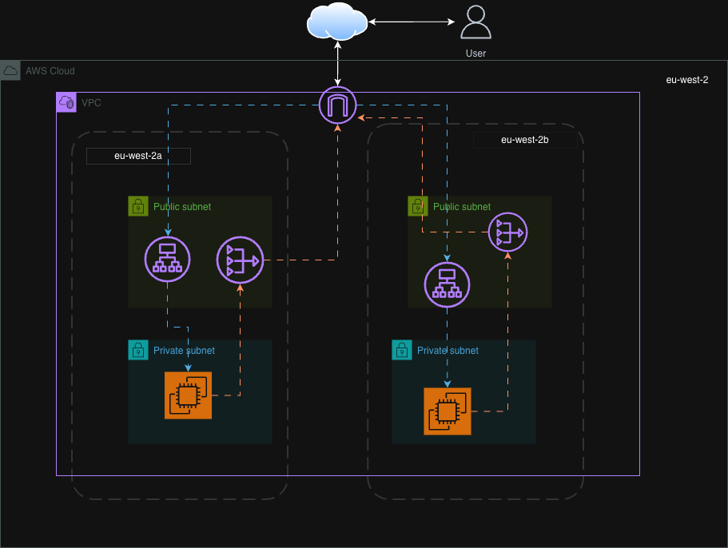
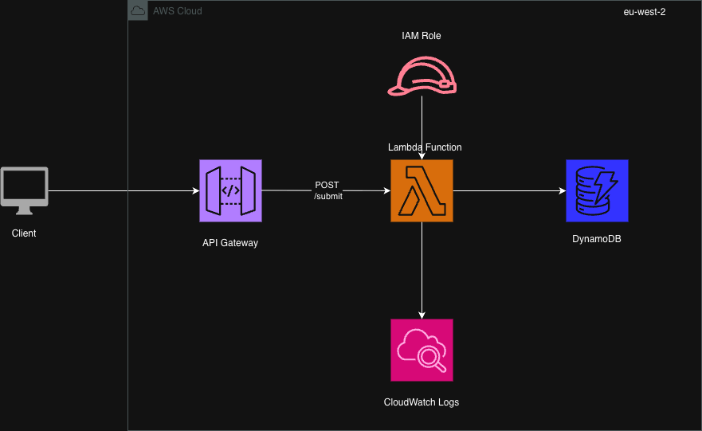

#                      AWS Assignments

This repository contains a collection of hands-on projects demonstrating core concepts in AWS cloud infrastructure, networking, security, and automation. Each project is self-contained in its own directory with a detailed README, configuration screenshots, and an architecture diagram.

---

### Assignment 1: Custom VPC & Networking

This Assignment involved building a custom Virtual Private Cloud (VPC) in AWS from the ground up. The primary objective was to create a secure, two-tier network architecture that isolates backend resources from the public internet while allowing controlled administrative access via a Bastion Host.

**[➡️ View Assignment Details](./Assignment1/README.md)**

---

### Assignment 2: High-Availability Web Application with ALB

This Assignment implements a highly available, two-tier web application architecture using an Application Load Balancer (ALB) to distribute traffic across two EC2 instances. The design isolates backend instances in private subnets for enhanced security and resilience.

**[➡️ View Assignment Details](./Assignment2/README.md)**

---

### Assignment 3: Production-Ready Static Website on AWS

This Assignment covers the deployment of a secure, scalable, and high-performance static website using a serverless architecture. The solution leverages S3 for hosting, CloudFront as a global CDN for low-latency content delivery and SSL, and Route 53 for DNS management.

**[➡️ View Assignment Details](./Assignment3/README.md)**

---

### Assignment 4: Serverless API with Lambda, IAM, and API Gateway

This Assignment demonstrates a hands-on, production-like serverless workflow on AWS. The goal was to build a simple REST API that accepts a `POST` request, processes it with a Lambda function, and stores the data in a DynamoDB table, following the principle of least privilege for IAM permissions.

**[➡️ View Assignment Details](./Assignment4/README.md)**
