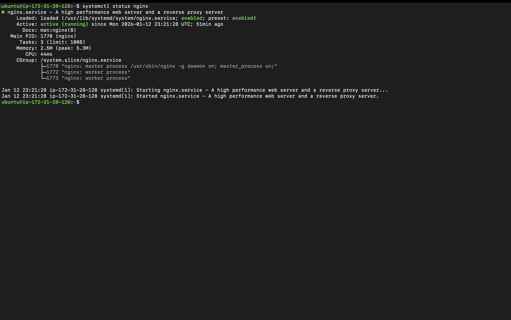

Networking Project: Website with Custom Domain

Project Goal

Make a website accessible using my own domain name hayatosman.com.

What I Built

I created a complete website setup:

1. Bought my own domain hayatosman.com on Cloudflare
2. Launched a server on AWS EC2 (Ubuntu)
3. Installed NGINX web server
4. Connected hayatosman.com to my server using DNS
5. Made the website public by opening port 80


### EC2 Instance


### Security Groups


### DNS Records


### NGINX Status


### Live Website

Commands I Used (Ubuntu)

```bash
# Connect to my server
ssh -i my-key.pem ubuntu@my-server-ip

# Update and install NGINX
sudo apt update
sudo apt install nginx -y

# Start the web server
sudo systemctl start nginx
sudo systemctl enable nginx

# Check if it's running
sudo systemctl status nginx
```

What I Learned

1. DNS (Domain Name System)

· DNS is like a phonebook for the internet
· It turns domain names (hayatosman.com) into IP addresses
· A records point directly to IP addresses

2. Ports

· Port 80 is for websites (HTTP)
· Port 22 is for server management (SSH)
· Different services use different ports

3. Cloud Servers

· EC2 is a virtual computer in the cloud
· Public IP = address everyone on internet uses
· Private IP = address only AWS uses internally

4. Security Groups

· Like a firewall for your server
· Controls who can access your server
· I opened port 80 to everyone and port 22 just for me

Challenge I Faced

Problem: My website wasn't loading after setting up DNS

What happened:

· I set up the DNS records for hayatosman.com in Cloudflare
· Waited a few minutes
· Tried to visit hayatosman.com but got an error

How I fixed it:

1. Learned about DNS propagation - it takes time to update everywhere
2. Used nslookup hayatosman.com to check if DNS was working
3. Waited about 5 more minutes
4. Refreshed my browser and it worked!

What I learned: DNS doesn't update instantly. It needs time to spread to all internet servers.

Final Result

Now when I type hayatosman.com in a browser, it shows the "Welcome to NGINX" page from my AWS server!
