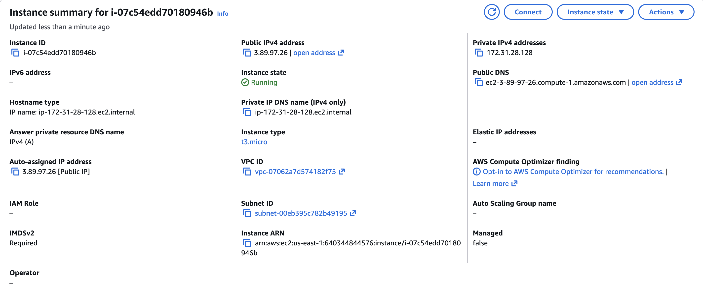
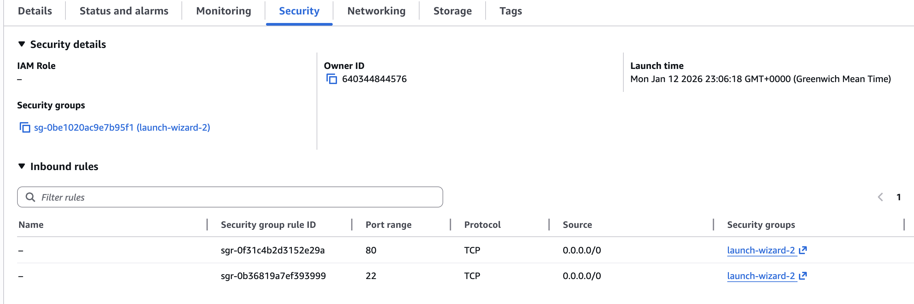

    

# Networking assignment

Successfully completed the networking module assignment by purchasing my own domain hayatosman.com, deploying an NGINX web server on AWS EC2, and configuring DNS to make the website accessible via my custom domain. This project demonstrates practical application of networking concepts including DNS resolution, IP addressing, routing, firewall configuration, and HTTP protocols.


### 1. Domain Registration on Cloudflare

· Purchased hayatosman.com through Cloudflare registrar

### 2. AWS EC2 Instance Setup

· Launched an EC2 instance with Ubuntu 

· Selected t2.micro instance type

· Created and downloaded a new key pair for SSH access

### 3. Security Group Configuration

Created a security group with the following inbound rules:

· Port 80 (HTTP): Open to 0.0.0.0/0 for public web access

### 4. NGINX Installation on Ubuntu

Connected to my EC2 instance via SSH and installed NGINX:

```bash
ssh -i "my-key.pem" ubuntu@ec2-ip-address
sudo apt update
sudo apt install nginx -y
sudo systemctl start nginx
sudo systemctl enable nginx
sudo systemctl status nginx
```

### 5. DNS Configuration

Logged into Cloudflare dashboard and created two A records:

· Record for @ (root domain: hayatosman.com) → [EC2 Public IP]

· Record for www (www.hayatosman.com) → [EC2 Public IP]


### EC2 Instance

EC2 instance showing public IP, private IP, and running state
### Security Groups

Security group allowing HTTP (port 80) and SSH (port 22) access
### DNS Records

Cloudflare DNS with A records pointing to EC2 public IP
### NGINX Status

Verifying NGINX is running with systemctl status nginx
### Live Website

NGINX default page loading at hayatosman.com


## What I Learned

1. **DNS in real use**

I learned how DNS translates a domain name into an IP address. When someone visits hayatosman.com, DNS resolves the domain and directs the request to the correct server hosting my website.

2. **Servers and IP addresses**

I now understand that an EC2 instance has both a public and a private IP. The public IP allows users on the internet to access the server, while the private IP is used for internal communication within AWS.

3. **Security and traffic control**

I configured AWS security group to control access to my server. HTTP traffic was allowed on port 80 for public access.

4. **End to end request flow**

Seeing the full request path made networking click for me. A request travels from the browser, through DNS, to the EC2 instance, where NGINX serves the web page back to the user.

## Challenge I Faced

The main challenge was that my website at `hayatosman.com` didn't load right after I set up the DNS. I figured out it was because of DNS propagation. I checked that the server itself was working using its IP address, then waited a few minutes. After that, my custom domain worked perfectly.

